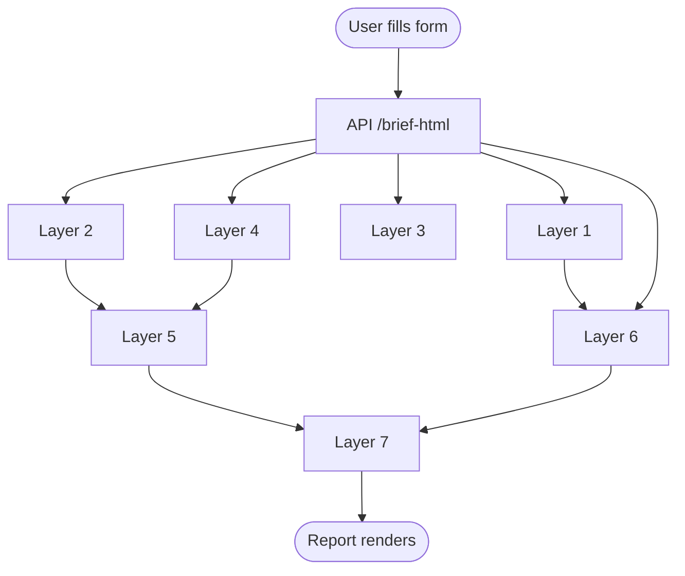

# Account Intel — Pre-Meeting Brief Engine

## What It Is

Account Intel generates a structured 7-layer pre-meeting brief for B2B sales conversations. It synthesizes account signals, industry context, prospect intelligence, tech stack analysis, competitive positioning, conversation orchestration, and discovery support — tailored to a specific prospect and product.

All 7 layers are generated by an LLM (`google/gemini-2.5-flash` via fal.ai) in ~60 seconds.

**Live Demo:** [account-intel-kappa.vercel.app](https://account-intel-kappa.vercel.app)

**Design:** Light editorial theme inspired by Sanity design system — clean white surfaces with gold accent (`#f5a623`), content-first layout, subtle shadows and borders.



---

## Getting Started

### Prerequisites
- Node.js 20+
- A Vercel account (free tier works)
- A GitHub account
- API keys (see below)

### Installation

1. **Clone the repository**
   ```bash
   git clone https://github.com/your-username/account-intel.git
   cd account-intel
   npm install
   ```

2. **Set up environment variables**
   Copy `.env.example` to `.env` and fill in your keys:
   ```bash
   cp .env.example .env
   ```
   Edit `.env` and add your API keys.

3. **Deploy to Vercel**
   ```bash
   npm install -g vercel
   vercel login
   vercel
   ```
   Follow the prompts. Vercel will automatically detect your project.

4. **Configure Environment Variables in Vercel**
   Go to your Vercel project dashboard → Settings → Environment Variables
   Add all variables from your `.env` file.

5. **Deploy**
   ```bash
   vercel deploy --prod
   ```

### Required API Keys

| Key | Purpose | Free Tier? |
|-----|---------|------------|
| `OLLAMA_API_KEY` | LLM for brief generation | Yes (local) or paid (remote) |
| `SERPAPI_API_KEY` | Google News search | Yes (100 searches/mo) |
| `GNEWS_API_KEY` | Alternative news source | Yes (100 searches/mo) |
| `BUILTWITH_API_KEY` | Tech stack detection | Yes (100 lookups/mo) |
| `GITHUB_TOKEN` | Save briefs/ICPs to GitHub | Yes (free) |

> **Note:** If you don't have API keys, the app will still work with limited functionality (news and tech detection will be skipped).

### Local Development

```bash
npm run dev
```
Open [http://localhost:3000](http://localhost:3000) to view the app.

---

## How to Use the Tool

### Step 1: Open the Application

Navigate to [account-intel-kappa.vercel.app](https://account-intel-kappa.vercel.app). The homepage shows the 7-layer framework overview and a "Configure Brief" button in the header.

### Step 2: Open the Configure Brief Form

Click the **Configure Brief** button in the top-right of the page. The form opens as a modal overlay.

### Step 3: Fill Out the Form

| Field | Required | Description |
|-------|----------|-------------|
| **Company** | No | The target account name (e.g. "Acme Corp"). Used throughout the report. |
| **Industry** | **Yes** | The vertical the prospect operates in. Selecting this auto-populates the signals textarea and sets a default pain point. |
| **Domain** | No | The prospect's website URL (e.g. "acme.com"). Used for technology stack detection in Layer 4. |
| **Product** | No | The product you are selling (e.g. "Salesforce", "ServiceNow"). Used for competitive positioning in Layer 5 and conversation path in Layer 6. |
| **Prospect role** | No | The job title/function of the person you're meeting (default: VP of Sales). Used for persona modeling in Layer 3. |
| **Seniority** | No | The seniority level of the prospect (default: VP/Director). Used alongside role to determine influence level in Layer 3. |
| **Account signals** | No | Buying triggers and context clues. Auto-populated from the selected industry. You can edit these — one signal per line. |
| **Pain point / topic** | No | The specific challenge or topic relevant to the conversation. Auto-populated from industry, but adjustable. |

**Available industries:** Finance, Healthcare, Technology, Retail, Manufacturing, Energy, Government / Public Sector, Education.

**Available roles:** CISO, CIO, CTO, VP of Sales (default), CFO, VP of Engineering, IT Director, SDR Team Lead.

**Seniority levels:** C-Level, VP/Director (default), Manager, IC.

### Step 4: Generate the Brief

Click **Generate Brief**. A new tab opens showing the generation progress across all 7 layers. After ~60 seconds, the full report renders in that tab. The modal closes automatically.

The brief is also saved to **Saved Briefs** on the homepage — you can reopen it later by clicking any saved brief card.

### Step 5: Read the Report

The report opens in a new tab with:
- **Top bar**: Company name, date, and "Save as ICP Profile" button
- **4 KPI stats**: Signal Strength, Talking Points, Influence Level, Tech Detected
- **7 layer cards**: Each with a numbered badge, title, subtitle, and content body

### Step 6: Save as ICP Profile

Inside the generated report, click **Save as ICP Profile** to save the current form configuration (company, industry, domain, role, seniority, signals, pain point). Saved profiles appear in the **ICP Profiles** section on the homepage. Click a profile to pre-fill the form for a similar account.

---

## The 7 Layers Explained

### Layer 1 — Why This Account?

**Fields:**
- **Thesis** — One-sentence account rationale: why this account matters and why now. (max 25 words)
- **Reason to act** — The primary pressure driving the account to change. (max 15 words)
- **Signal strength** — Rating of signal set urgency: `HIGH` (strong, red), `MEDIUM` (moderate, yellow), `LOW` (weak/inferred, green).
- **Questions to ask on the call** — 3 validation questions the rep should verify during the conversation.

**What it tells you:** Whether the account is worth pursuing right now and what's driving their need for change.

### Layer 2 — Industry Context

**Fields:**
- **Headline** — One-sentence summary of the most relevant industry trend. (max 20 words)
- **Talking points to use** — 3 concise industry points the rep can reference to build credibility. (max 15 words each)
- **Recent news** — 3 realistic recent developments with headline, date, and relevance explanation.
- **Industry trend** — One-sentence describing an ongoing shift in this vertical. (max 20 words)

**What it tells you:** Current trends and news to reference in conversation, positioning the rep as informed.

### Layer 3 — Who You're Meeting

**Fields:**
- **Influence level** — Their decision-making power (see below).
- **What worries them** — 3 key concerns specific to this persona. (max 12 words each)
- **What they care about** — 3 priorities this persona focuses on. (max 10 words each)
- **Questions they'll ask** — 3 likely questions from this persona. (max 15 words each)
- **Success metric** — What success looks like to this persona. (max 15 words)
- **Tailored message** — One-sentence message customized to this persona. (max 25 words)

**Influence levels:**
| Level | Meaning | Typical Assignments |
|-------|---------|-------------------|
| `DECISION-MAKER` | Has authority to approve purchases | C-Level roles (CISO, CIO, CTO, CFO) |
| `INFLUENCER` | Shapes decisions without final authority | VP/Director level |
| `CHAMPION` | Advocates internally for your solution | VP/Director level |
| `EVALUATOR` | Assesses options, does not decide | Manager, IC |

**What it tells you:** How to tailor the conversation around the specific person you're meeting.

### Layer 4 — Their Tech Setup

**Fields:**
- **Email** — Detected email platform (Microsoft 365, Gmail, Google Workspace, or Unknown).
- **Cloud** — Detected cloud provider (Azure, AWS, GCP/Google Cloud, or Unknown).
- **Devices** — Detected device platform (Windows, macOS, Linux, Chrome, Android, or Unknown).
- **Main competitor** — The determined incumbent vendor (Microsoft, Google, Apple, Linux, or None).
- **Technologies detected** — Specific technologies identified via domain analysis (shown as pill-shaped tags).
- **Confidence** — Detection reliability: `HIGH`, `MEDIUM`, or `LOW`.

**Tech detection:** Uses the domain URL to scan for technology footprints. Technologies are mapped to incumbent ecosystems (Microsoft, Google, Apple, Linux). If 2+ signals match an ecosystem, confidence is HIGH; 1 match = MEDIUM; 0 = LOW.

**What it tells you:** The prospect's current environment — helps identify compatibility, incumbent relationships, and assumptions to avoid.

### Layer 5 — How to Position Us

**Fields:**
- **Core message** — One-sentence competitive framing statement. (max 20 words)
- **Strategy** — The positioning approach (see below).
- **What they do well** — The incumbent's strength. (max 15 words)
- **Our advantage** — Our product's clear differentiator. (max 15 words)
- **Position against them** — 3 phrases for when the buyer compares us vs the incumbent. (max 12 words each)
- **Phrases to avoid** — 2 phrases that sound negative or replacement-led (shown with red left border).

**Positioning styles:**
| Style | Meaning |
|-------|---------|
| `CO-EXIST` | Our product works alongside the incumbent |
| `COMPLEMENT` | Our product fills a gap the incumbent doesn't cover |
| `MIGRATION` | Our product replaces/upgrades from the incumbent |
| `GREENFIELD` | No incumbent present; we define the space |

**What it tells you:** How to handle competitive comparisons without sounding negative or replacement-led.

### Layer 6 — Your Conversation Path

**Fields:**
- **Best path** — Recommended primary conversation path.
- **Backup path** — Secondary path if the primary doesn't resonate.
- **When to bring up** — The signal or buyer statement that triggers this path. (max 15 words)
- **Value framing** — How to frame value in measurable terms. (max 20 words)
- **Suggested call flow** — 3 ordered conversation steps. (max 12 words each)

**Conversation paths:**
| Path | When to Use |
|------|-------------|
| Browser governance | Prospect has browser management concerns |
| DLP security | Prospect has data loss prevention needs |
| Shadow AI | Prospect is concerned about unauthorized AI use |
| Device refresh | Prospect is planning device upgrades |
| App delivery | Prospect needs application delivery solutions |
| Productivity suite | Prospect uses a productivity suite |

**What it tells you:** Which angle to lead with and the exact sequence of topics to cover.

### Layer 7 — Discovery Guide

**Fields:**
- **Questions to validate** — 4 natural-language prompts phrased as questions to ask in the meeting. (max 20 words each)
- **Buying signals** — 3 things to listen for that indicate interest or objection. (max 12 words each)
- **If they say, pivot to** — 2 pivot paths: if the buyer says X, respond with Y.
- **Phrases to avoid** — 2 phrases to avoid saying. (max 10 words each, shown with red left border)
- **Success criteria** — What a successful discovery call looks like. (max 20 words)

**What it tells you:** What to ask, what to listen for, and how to handle pushback during the meeting.

---

## Report Dashboard

The report top section shows 4 KPI stats:

| Stat | Source | What It Measures |
|------|--------|-----------------|
| **Signal Strength** | Layer 1 `signal_confidence` | Urgency/strength of account signals |
| **Talking Points** | Layer 2 talk_tracks + Layer 3 priorities | Amount of conversation material generated |
| **Influence Level** | Layer 3 `influence_level` | Prospect's decision-making authority |
| **Tech Detected** | Layer 4 `detected_tech` | Number of technologies found via domain scan |

---

## Saved Briefs & ICP Profiles

### Saved Briefs
Every generated brief is automatically saved as a JSON file in the `briefs/` folder of the GitHub repo and appears in the **Saved Briefs** section. Click any saved brief to reopen it in a new tab. Delete using the trash icon.

### ICP Profiles
Saved form configurations that let you quickly pre-fill the form for similar accounts. Saved from the report page via **Save as ICP Profile**. Click a profile to apply it — the form pre-fills with that profile's data.

---

## Glossary

| Term | Definition |
|------|------------|
| **Account summary** | One-sentence rationale for why this account matters and why now (Layer 1) |
| **Buying signals** | Verbal cues indicating interest or objection; things to listen for (Layer 7) |
| **Confidence** | Tech detection reliability rating (HIGH / MEDIUM / LOW) in Layer 4 |
| **Incumbent** | The dominant technology vendor in the prospect's environment (Microsoft, Google, Apple, Linux) |
| **ICP Profile** | Ideal Customer Profile — saved form state for reusing on similar accounts |
| **Influence level** | A prospect's decision-making power: decision-maker, influencer, champion, evaluator |
| **Lead path** | The recommended primary conversation angle for the call (Layer 6) |
| **Pain point** | The specific challenge or topic relevant to the sales conversation |
| **Pivot path** | A predefined response when the buyer says a specific objection (Layer 7) |
| **Positioning style** | Strategic approach to competitive framing: co-exist, complement, migration, greenfield |
| **Signal strength** | Rating of how urgent/strong the account signals are (HIGH / MEDIUM / LOW) |
| **Signals** | Account buying triggers and context clues entered by the user or auto-populated |
| **Talking points** | Industry-relevant points the rep can use to build credibility (Layer 2) |
| **Validation prompts** | Questions the rep should verify during the meeting (Layers 1 and 7) |

---

## Architecture Notes

- **Frontend**: Vanilla ES6, single HTML file (`index.html`), no build step
- **Backend**: Vercel serverless functions (Node.js) in the `api/` directory
- **LLM**: gemma3:4b via hosted Ollama API at `ollama.com/api/chat`
- **API key**: Set as `OLLAMA_API_KEY` environment variable in Vercel
- **Persistence**: GitHub repo file storage (`briefs/` and `icps/` folders on `main` branch) via Vercel serverless functions
- **Tech detection**: `technology-detector` npm package for domain-based stack analysis
- **Execution**: Layer 1-4 run in parallel (Wave 1), then Layer 5-6 (Wave 2), then Layer 7 (Wave 3)
